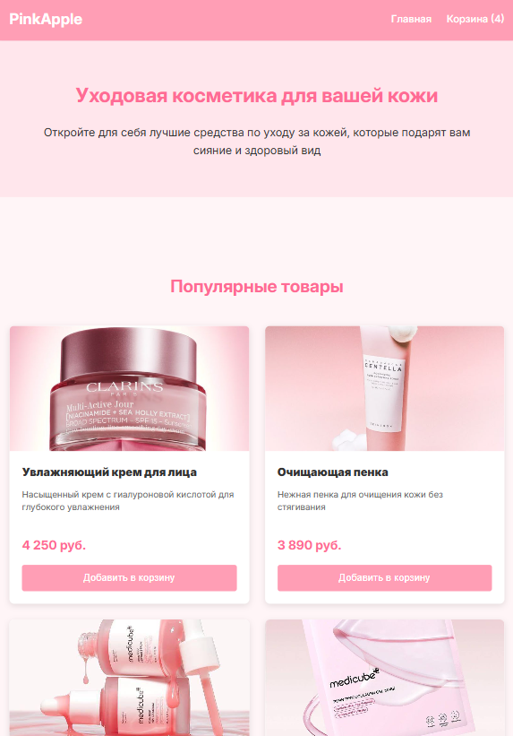
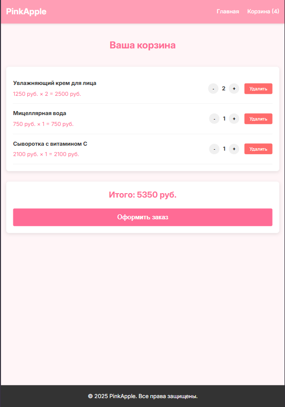
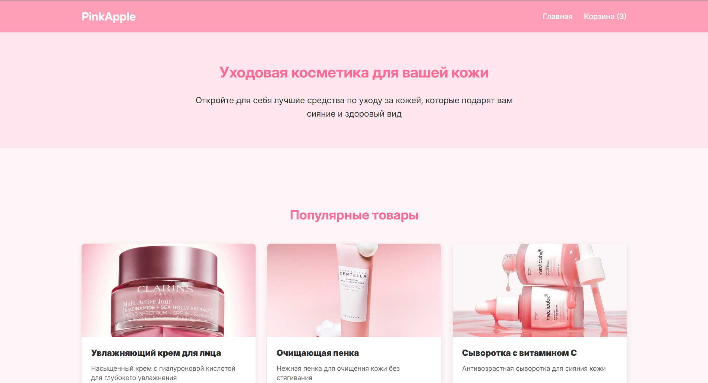
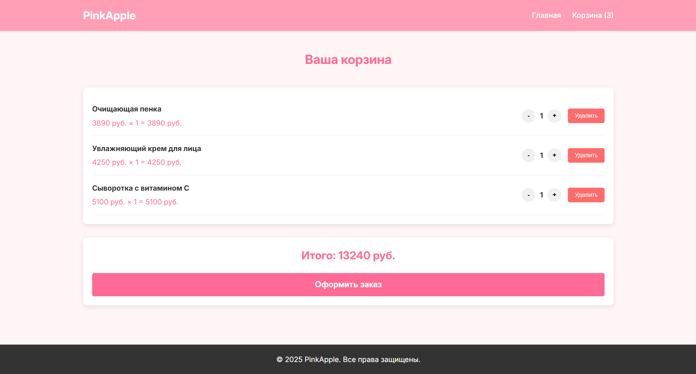
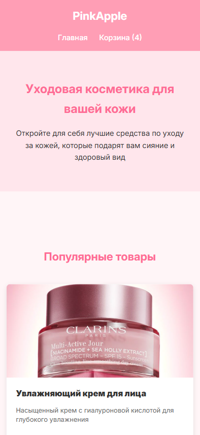
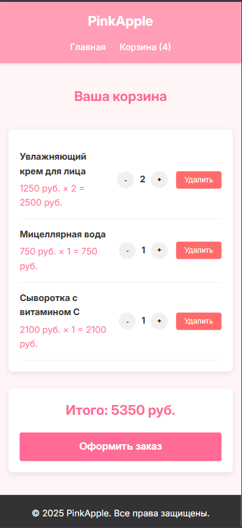

# cosmetic-shop
Интернет-магазин косметики - учебный проект
В рамках данной работы я разработала интернет-магазин PinkApple с каталогом косметических средств с интуитивно понятным интерфейсом и полнофункциональной корзиной покупок. Сайт предназначен для продажи уходовой косметики и обеспечивает удобный процесс выбора и заказа товаров.

# Технические требования
В работе был использован чистый JavaScript + HTML и CSS без фреймворков. Сайт размещен на GitHub Pages.

# Обязательные требования к работе

## Макет и верстка

- Главная страница с карточками товаров (название, цена, кнопка "Добавить в корзину")

- Семантическая разметка - использованы <header>, <main>, <section>, <article>, <footer>

- Форма оформления заказа содержит все обязательные поля: имя, фамилия, адрес, телефон

## Адаптивность
- Сайт корректно отображается на ноутбуке и планшете






- Сайт корректно отображается на телефоне



## Логика корзины
- Добавление товаров в корзину с подсчетом суммы

- Удаление товаров из корзины

- Изменение количества товаров с автоматическим пересчетом суммы

- Сохранение в localStorage - данные сохраняются при обновлении страницы

- Корректное отображение итоговой суммы
## Форма заказа
- Форма открывается при нажатии на кнопку «Оформить заказ» (встроенная или модальное окно)

- После заполнения всех полей и нажатия «Создать заказ» появляется сообщение «Заказ создан!
# Дополнительные улучшения

## 1. Улучшенный UX/UI дизайн
- Анимированные уведомления с возможностью перехода в корзину по клику
- Hover-эффекты на карточках товаров с плавным масштабированием изображений
- Градиентные кнопки с эффектами при наведении
- Адаптивная цветовая схема в розовых тонах, соответствующая тематике косметики

## 2. Расширенный функционал корзины
При добавлении товара в корзину, появляется уведмлени, на которое можно нажать и будет редайрект в корзину.
```javascript
function showNotification(message, redirectToCart = false) {
    if (redirectToCart) {
        notification.style.cursor = 'pointer';
        notification.addEventListener('click', function() {
            window.location.href = 'cart.html';
        });
    }
}
```
## 3. Продвинутая валидация
Regex-проверка телефона: /^[\+]?[0-9\s\-\(\)]+$/
Trim() обработка всех текстовых полей
Информативные сообщения об ошибках
## 4. Кликабельное лого PinkApple
При нажатии на лого из корзины/главной страницы происходит редайрект на главную страницу